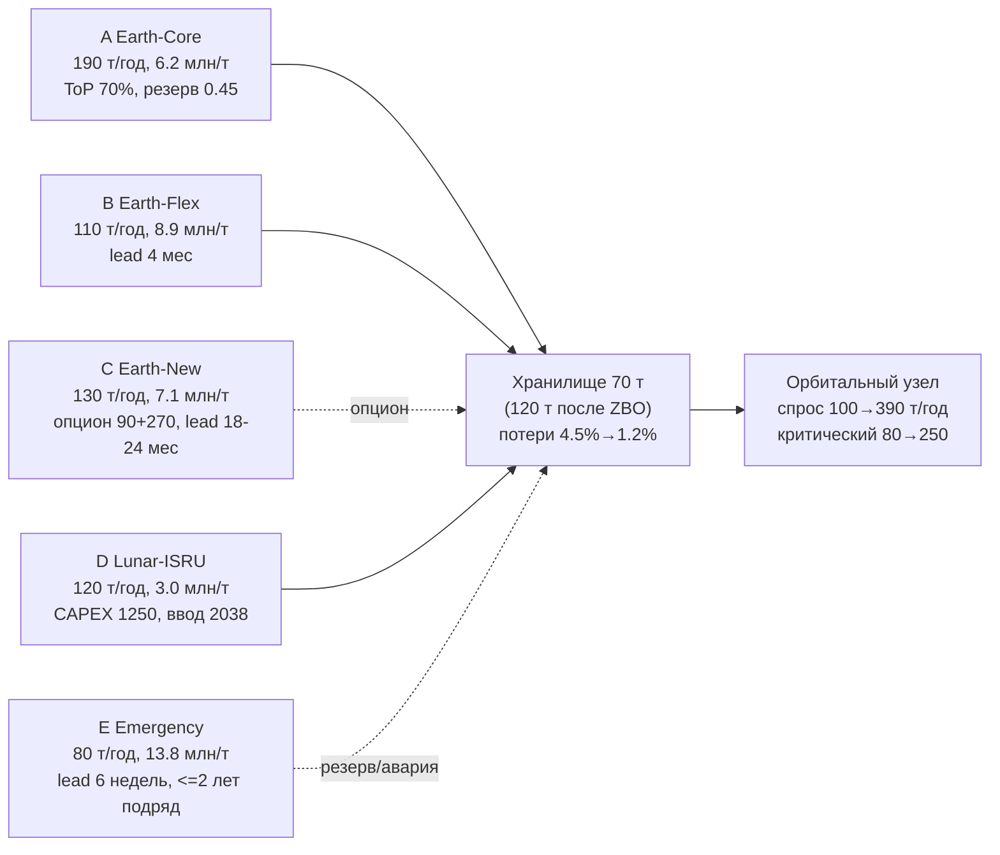

# Управленческая записка: снабжение орбитального топливного узла, 2035–2040

> Кейс «Топливный космоконтур 2035», КосмоХакатон 2026. Все цифры получены расчётным
> ядром `fuelloop` (см. README), воспроизводимы командой `python -m fuelloop.cli run --risks --sensitivity --monte-carlo`.

## 1. Резюме

Рекомендуемая стратегия: **A Earth-Core как базовый канал + буферы B Earth-Flex +
Lunar-ISRU с 2038 + ZBO-модернизация хранилища + E Emergency в резервном режиме**.

- Стандартный сценарий: обслуживание 100% (общий и критический спрос), NPV расходов
  **8023 млн у.е.**, CAPEX **1430 млн** (лимит к 2037 — 1800, использовано 1030 млн).
- Обязательный стресс: дефицит **151,1 т** (2038–2040) из-за недопоставки ISRU
  (55%/75% плана); критический спрос обслужен полностью; жёстких нарушений нет.
- Модель честно показывает дефицит в стрессе и не «улучшает» его задним числом —
  по правилам кейса 99/97% в стрессе являются ориентирами устойчивости.

## 2. Архитектура решения

```
data/ (JSON/CSV)  →  loaders  →  scenarios (копия)  →  engine (ядро)
                                                        ├── balance (помесячный баланс)
                                                        ├── economics (платежи, NPV)
                                                        ├── constraints (проверки)
                                                        └── risks (реестр, чувствительность, МК)
configs/ (план + сценарии) ─────────────────────────────┘
выход: results/ (CSV/XLSX)  +  Streamlit-интерфейс оператора
```

Чат-слой отсутствует намеренно: все цифры считает ядро, интерфейс только задаёт
решения (каналы/резервы/отборы/инвестиции) и отображает результаты. Один вход —
один выход, полная воспроизводимость (тесты фиксируют контрольные числа).

## 3. Данные и допущения

Источник данных: условия кейса (спрос, каналы A–E, хранилище, инвестопции, ограничения).
Файлы: `data/demand.csv`, `data/channels.json`, `data/storage.json`, `data/investments.json`,
`data/constraints.json`.

Ключевые допущения (полный список выгружается в `results/assumptions_*.csv`):

1. Поступления по каналам распределены равномерно по году (помесячно), спрос равномерный.
2. Потери = throughput × коэффициент действующего хранилища, начисляются один раз при поступлении.
3. Надёжность каналов не умножает объёмы в стандартном сценарии (правило кейса) —
   учитывается в реестре рисков и Монте-Карло.
4. Стартовый запас 12,33 т (45 дней спроса 2035) закуплен у B, оплата t=0, в CAPEX не входит.
5. Политика дефицита: critical_first — критический спрос обслуживается первым.
6. NPV: реальная ставка 10%, операционные потоки и CAPEX — на середину года платежа.
7. OPEX ZBO/ISRU начисляется с полного года после ввода (ZBO: оплата 2036 → ввод 2037).

## 4. Схема цепочки поставок



## 5. Сравнение стратегий (результаты ядра)

| Стратегия | NPV стандарт | CAPEX | Обслуживание (стандарт) | NPV стресс | Дефицит стресс | Мин. обслуж. стресс |
|---|---|---|---|---|---|---|
| **Базовый план (A+B+ISRU+ZBO)** | **8023** | 1430 | 100% | 8419 | 151,1 т | 81,3% |
| Без ISRU (только A+B) | невыполним: 5 нарушений, обслуживание 65,8% | 180 | — | 6663 | 391,2 т | 57,2% |
| Без ZBO | 7802, 2 нарушения (резерв) | 1250 | 100% | 8226 | 165,2 т | 80,7% |
| Earth-New (C) вместо ISRU | 8017 | 540 | 100% | 8420 | 94,8 т | 87,0% |

Выводы:

- **ISRU или C обязательны**: без них спрос 2038–2040 физически не покрывается (A+B = 300 т/год < 390).
- **C vs D**: Earth-New даёт почти тот же NPV при CAPEX 540 вместо 1430 и лучше держит
  стресс (C не подвержен шоку ISRU). Но D дешевле в эксплуатации (3,0 против 7,1 млн/т) —
  на пике 2040 отбор 120 т/год экономит ~530 млн/год переменных затрат; кроме того,
  лунный канал диверсифицирует земные риски. Базовый план выбирает D как стратегическую
  ставку; C — готовый антикризисный резерв (опцион 90 млн).
- **ZBO оправдан**: без него нарушается 45-дневный резерв (потери 4,5% съедают буфер)
  и предел потерь 2% в стрессе, плюс ёмкость 70 т тесновата на пике.

## 6. Контрактно-финансовая архитектура

- **A**: долгосрочный take-or-pay 70% от зарезервированной мощности; резерв 0,45 млн за т/год.
  В базовом плане резерв = отбор (100→190 т/год), ToP-минимум не активируется сверх отбора.
- **B**: гибкий канал без ToP — инструмент буферизации 45-дневного резерва (10–85 т/год).
- **C**: опцион: 90 млн (право, 2035) + 270 млн (реализация) — держится как антикризисная
  опция против провала ISRU; в базовом плане не реализуется.
- **D**: CAPEX 1250 млн траншами 625+625 в 2036–2037 (дедлайн 2037), OPEX 70 млн/год с 2038.
- **E**: резерв мощности 10 т/год с 2038 (3,5 млн/год) — покрывает разницу 45-дневного
  резерва и физического запаса в стрессе; активация 42 дня ≤ 45; как базовый канал
  не используется (правило 2 лет).
- **ZBO**: CAPEX 180 млн в 2036, ввод 2037: потери 4,5%→1,2%, ёмкость 70→120 т, OPEX 12 млн/год.

CAPEX-профиль: 2035: 0; 2036: 805 (ZBO 180 + ISRU 625); 2037: 1430 (ISRU 625); итог 1430 ≤ 2800.

## 7. Стресс-тест (обязательный) и устойчивость

Шок: спрос +15% (2038–2040), цены A/B +25% (2038–2039), фактические доли ISRU
55%/75%/100%, предел потерь ≤2%. План не менялся задним числом.

| Год | Спрос, т | Поступление, т | Дефицит, т | Обслуживание |
|---|---|---|---|---|
| 2038 | 287,5 | 235,0 | 24,2 | 91,6% |
| 2039 | 368,0 | 303,0 | 68,6 | 81,3% |
| 2040 | 448,5 | 395,0 | 58,2 | 87,0% |

Критический спрос обслужен на 100% (политика critical_first). Резерв на начало 2038
покрыт контрактом E; в 2039–2040 физический запас выгорает — отклонение зафиксировано
в `stress_findings` как сигнал для оператора. Доп. расходы стресса ≈ +396 млн NPV
(цена A/B) при недопоставке ISRU без возврата платежей.

## 8. Чувствительность и Монте-Карло

Чувствительность (один фактор, `results/sensitivity_standard.csv`):

- Спрос ×1.1 — план держит ограничения; ×1.2 — появляются жёсткие нарушения
  (граница применимости базового плана ~ +15…17% спроса).
- Ставка 6→14%: NPV 9019→7193 млн (монотонно).
- CAPEX ISRU 1500 млн: план остаётся выполнимым (запас лимита 1800: 1430+250 = 1680).

Монте-Карло (n=1000, seed=42; спрос N(1, 6%), доля ISRU triangular(base±0.25/0.10),
цены A/B U(1, 1.25) в 2038–2039):

- P(критическое обслуживание < 99%) = **0%** — критический спрос защищён политикой.
- P(общее обслуживание < 97%) = 30,6%; P(дефицит > 0) = 36%; дефицит p90 = 81,6 т.
- NPV: p50 = 8253, p90 = 8453 млн.

## 9. Реестр рисков (фрагмент; полный — results/risk_register.csv)

| ID | Риск | P | Импакт | Меры |
|---|---|---|---|---|
| R1 | Недопоставка ISRU в 1-й год (надёжность 0,78) | 0,22 | 13,2 т / 143 млн | резерв E, буфер 2037 |
| R2 | Шок ISRU 55/75% (стресс) | 1,0 | 92,8 т / 1280 млн | опцион C, критический спрос первым |
| R3 | Удорожание A/B +25% | 0,30 | +396 млн NPV | фиксация формулы цены в A |
| R4 | Задержка ZBO | 0,15 | 38 т / 247 млн | финансирование с резервом года |
| R5 | Перерасход CAPEX ISRU +20% | 0,20 | +250 млн | транши с контрольными точками |
| R7 | Отключение канала A (геополитика) | 0,10 | сценарий custom_geopolitics | опцион C, диверсификация |

## 10. Интересы сторон

- **Оператор узла**: минимизация NPV при гарантии критического спроса → базовый план.
- **Земные поставщики A/B**: стабильный take-or-pay; A заинтересован в долгом контракте, B — в гибкости.
- **Лунный оператор D**: ранняя фиксация CAPEX-траншей; риск недопоставки остаётся на нём (без возврата платежей).
- **Новый поставщик C**: продажа опциона 90 млн даёт доход без гарантии реализации.
- **Государство/страховщик**: интерес в резервах и исполнении критического спроса — закрывается policy critical_first и резервом E.

## 11. KPI

- Обслуживание общего спроса ≥ 97% (стандарт: 100%; стресс: 81,3% — ориентир)
- Обслуживание критического спроса ≥ 99% (100% в обоих сценариях)
- CAPEX к 2037 ≤ 1800 млн (факт 1030); итог ≤ 2800 (факт 1430)
- Потери ≤ 2% оборота после ZBO (факт 1,2%)
- 45-дневный резерв на начало года (физический или контракт E)
- Дефицит p90 (Монте-Карло) ≤ 82 т при n=1000

## 12. Дорожная карта

- **2035**: контракт A (100 т), буфер B, закупка стартового запаса 12,33 т, решение по опциону C (90 млн — рекомендуется).
- **2036**: ZBO CAPEX 180 + ISRU транш 625; рост A до 140 т.
- **2037**: ISRU транш 625 (итог 1250 к дедлайну); подготовка ввода ISRU.
- **2038**: ввод ISRU (60 т), E в резерв; мониторинг фактической доли ISRU — триггер реализации опциона C при < 80%.
- **2039–2040**: ISRU 120 т, B до 85 т; пересмотр буферов под фактическую надёжность D.
